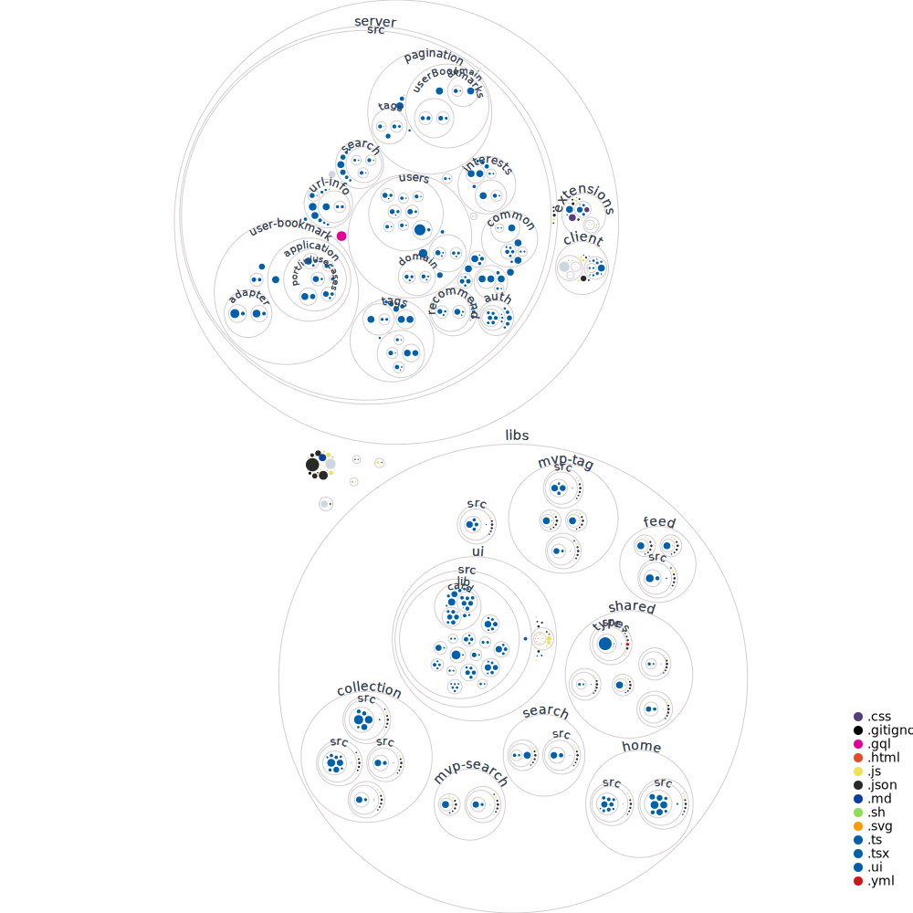

# Readable

[](https://dashboard.heroku.com/apps/readable-2021) [](https://vercel.com/tkhwang/readable) [](https://stackshare.io/readable2021dev/readable)

Read and share anything readable in **Readable** !

- Related : [Chrome extension for saving bookmark](https://github.com/zlrlo/readable-extensions)

## Feature

Anti-social social bookmark service

- [x] Saving bookmark under user `interest` with various `tags`
- [x] Suggest bookmarks based on `tag` analysis
- [x] Search bookmarks
- [ ] Add event in Google calendar for reading
- [ ] Fantastic UI update
- ...

## [Visualize repo](https://next.github.com/projects/repo-visualization)



## Prerequite

```bash
npm install -g @nrwl/cli    // nx
npm install -g @nestjs/cli  // nest
```

## Install

```bash
yarn
```

## Run

For local development, use `yarn dev server` and `yarn dev client`.

#### Server: nx nest.js app

```bash
yarn dev server
```

#### Client: nx next.js app

```bash
yarn dev client
```

#### Codegen for `client`

```bash
yarn codegen
```

#### ⚠️⚠️⚠️ Caution !!!

Don't use `yarn start` for local development.<br />
Now it's **only for deployment.**

```bash
# Don't use for local development. Now it's for the deployment.
yarn build
yarn start
```

## Commit message

```
type (module): commit message
      client
      server

🚚 (client): Move app module to the top
📦 (server): Add typeorm and mysql package
```

#### VSCode

Search/Select emoji for indicating type of commit and write commit message.

[Gitmoji - Visual Studio Marketplace](https://marketplace.visualstudio.com/items?itemName=Vtrois.gitmoji-vscode)

## Design Policy

- Monorepo using NX
- Use GraphQL efficiently for UI update

#### Backend

- GraphQL
  - Code first. (Not schema first)
  - Separate GraphQL model and persistent model.
  - Not One model for Graphql and DB entity.

* Use efficiently Apollo client cache for updating after mutation
* DDD style folder architecture

```
// module (user-bookmark)
├── user-bookmark
│   ├── applications
│   │   └── usecases
│   │       ├── add-user-bookmark-with-auth
│   │       ├── delete-user-bookmark-with-auth
│   │       ├── get-my-user-bookmarks-with-auth
│   │       └── sync-google-calendar-with-auth
│   ├── domain
│   │   ├── errors
│   │   │   └── user-bookmark.error.ts
│   │   └── model
│   │       └── user-bookmark.model.ts
│   ├── infrastructures
│   │   └── typeorm
│   │       ├── entities
│   │       │   └── user-bookmark.entity.ts
│   │       └── repositories
│   │           └── user-bookmark.repository.ts
│   ├── user-bookmark.controller.ts
│   ├── user-bookmark.module.ts
│   ├── user-bookmark.resolver.ts
│   └── user-bookmark.service.ts
```

#### Frontend

- Fully utilize NX monorepo features : `libs` and `feature`
- Styling using `tailwind css`

## Deploy

### 1. Quick and Dirty

Before the AWS configuration, use quick and dirty.

- heroku for `server` nx nest.js app
- vercel for `client` nx next.js app

#### heroku

nest.js with production built static files (client)

```bash
yarn build
yarn start
```

#### 2. AWS

AKS using kubernete.

## Ref: Server/Port/DB

| Environment | `apps`   | `NODE_ENV`    | DB          | Port     | URL                                         |
| ----------- | -------- | ------------- | ----------- | -------- | ------------------------------------------- |
| development | `server` | `development` | development | `7000`   | http://localhost:8000/graphql               |
|             | `client` | `development` | development | `4200`   | http://localhost:4200                       |
| staging     | `server` | `production`  | development | `80/443` | https://readable-2021.herokuapp.com/graphql |
|             | `client` | `production`  | development | `80/443` | https://readable-2021.vercel.app            |
